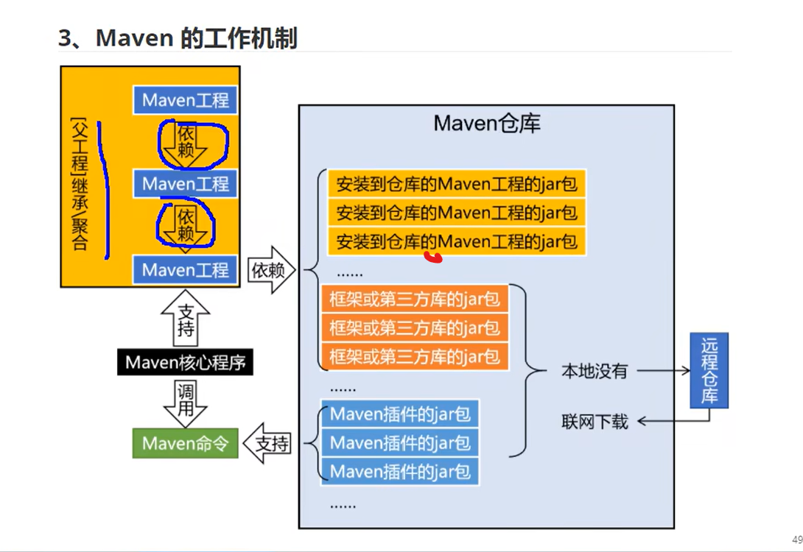
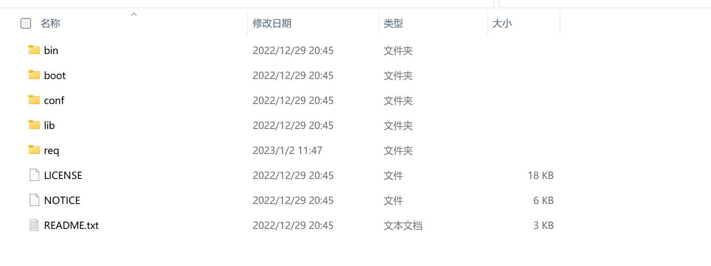

# 一，Maven作为依赖工具
## 1.1 jar包的规模
   随着各种框架的使用，项目中需要导入的jar包越来越多，由此引入Maven管理jar包
## 1.2 Maven作为构建管理工具
   Maven是专门为Java项目提供构建和依赖管理支持的工具
   ### 1.2.1 构建
   构建过程包含的主要环节：
   * 清理：删除上次构建的结果，为下次构建做好准备
   * 编译：Java源程序编译成*.class字节码文件
   * 测试：运行提前准备好的程序
   * 报告：针对刚才测试的结果生成一个全面的信息
   * 打包
        * Java工程：jar包
        * Web工程：war包
   * 安装：把一个Maven工程通过打包操作生成的jar包或war包存入Maven仓库
   * 部署：将准备好的jar包或war包部署到服务器上运行
   ### 1.2.2 依赖
   如果A工程里里面用到了B工程的类，接口，配置文件等等这样的资源，那么我们就可以说A依赖B
   依赖管理这种要解决的具体问题：
   * jar包的下载：使用Maven之后，jar包会从规范的远程仓库下载到本地
   * jar包之间的依赖：通过依赖的传递性自动完成
   * jar包之间的冲突：通过对依赖的配置进行调整，让某些jar包不会被导入
   ### 1.2.3 Maven的工作机制
   
## 1.3 Maven核心程序
   ### 1.3.1 核心程序
   1.官网下载Maven核心程序包，解压至非中文，无空格的文件目录下
   
   其中conf/setting.xml为核心配置文件
## 1.4 指定本地仓库
    <localRepository>e:\mavenigt</localRepository>
##1.5 配置阿里云仓库
     <mirror>
          <id>nexus-aliyun</id>
          <mirrorOf>central</mirrorOf>
          <name>Nexus aliyun</name>
          <url>http://maven.aliyun.com/nexus/content/groups/public</url>
      </mirror>
## 1.6 配置Java版本
     <profile>
              <id>jdk-11</id>
              <activation>
                  <activeByDefault>true</activeByDefault>
                  <jdk>11</jdk>
              </activation>
              <properties>
                  <maven.complier.source>11</maven.complier.source>
                  <maven.complier.target>11</maven.complier.target>
                  <maven.complier.complierVersion>11</maven.complier.complierVersion>
              </properties>
          </profile>
   
   