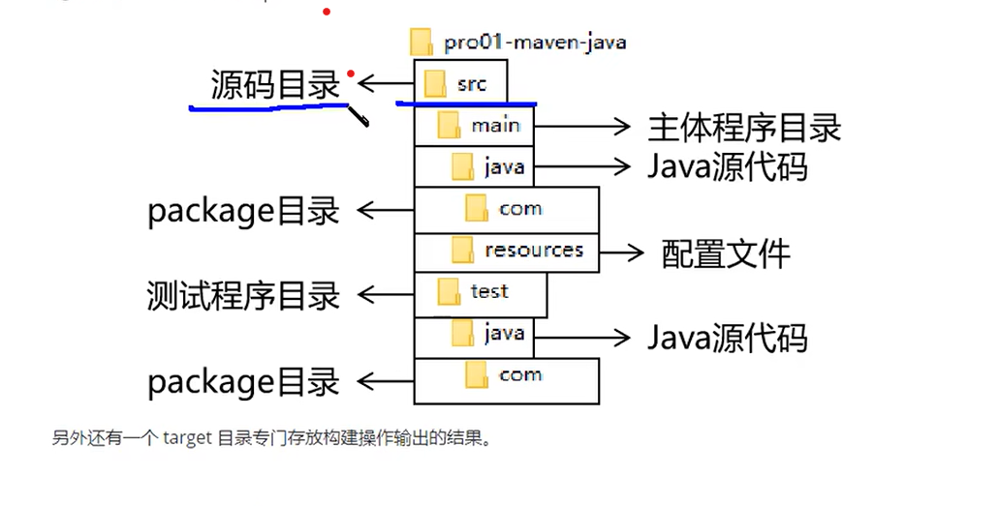

# 一，Maven的核心概念——坐标
## 1.1 Maven中的坐标
### 1.1.1 向量说明
    使用三个向量在【Maven的仓库】中唯一的定位到一个【jar】包
   * groupid：公司或组织的id
   * artifactid：一个项目或者是项目中的一个模块的id
   * version：版本号
### 1.1.2 三个向量的取值方式
   * groupid：公司或组织域名的倒序，通常会加上项目名称
        * 例如：com.XX(公司名).xxx(项目名)
   * artifactid：模块的名称，将来作为Maven工程的工程名
   * version：模块的版本号，根据自己自己的需要设定
## 1.2 坐标和仓库中jar包的存储路径之间的对应关系
## 1.2 实验操作
   ###1.2.1 创建目录作为后面操作的工作空间
   三个目录：
   * Maven核心程序
   * Maven本地仓库
   * 本地工作空间
  1，创建文件夹：E:\maven-worksapce\space001
  2。在此文件夹下运行命令：mvn archetype:generate
        其中mvn为主命令；archetype为插件；generate为目标
  3. 下载完成后，输入三个向量即可
    在pom.xml中修改junit的版本
  ###1.2.2 pom.xml标签解释
   project标签：表示对当前工程进行配置，管理
   modelVersion标签：从Maven2开始就固定是4.0.0，代表当前的pom.xml所采用的标签结构
   坐标信息：
        groupid标签：坐标向量之一，代表公司或组织开发的某个项目
        artifactId标签：坐标向量之一，代表项目下的某一模块
        version标签：坐标向量之一，代表当前的版本
   packaging标签：打包方式
        取值为jar：生成jar包，说明这是一个Java工程
        取值为war：生成war包，说明这是一个Web工程
        取值为pom：说明这个工程是用来管理其它工程的工程
   properties标签：在Maven中定义属性值
   dependencies标签：用来配置具体依赖信息的
   dependency标签：用来在dependencies内配置具体的依赖信息，通过坐标信息指定具体的依赖信息，想导入哪个jar包，配置他的坐标即可
   scope标签：配置当前依赖的范围

# 二，Maven的核心概念——POM
##2.1 含义
POM：project object model，项目对象模型
##2.2 模型化思维
POM表示将工程抽象化为一个模型，再用程序中的对象来描述这个模型，这样我们就可以用
程序来管理项目。在开发的过程中，最基本的做法就是将现实生活中的事物抽象为模型，然后
封装模型相关的属性作为一个对象，这样就能实现在程序中计算与现实事物相关的数据
##2.3 对应的配置文件
pom.xml为核心配置文件
# 三，Maven的核心概念——约定的目录结构
## 3.1 各个目录的作用

## 3.2 约定目录结构意义
Maven为了让构建的过程尽可能的自动化，所以必须约定目录结构的作用
## 3.3 约定大于配置
Maven对于目录结构这个问题，没有采用配置的方式，而是基于约定的，这样会让我们在开发过程更加的方便
约定大于配置，配置大于编码

代码测试——test文件夹中的类
````java
package XKT.XX.Maven;

import org.junit.Test;
// 静态导入的效果是将Assert类中的静态资源导入当前类
// 这样一来，在当前类中就可以直接使用Assert类中的静态资源，不需要写类名
import static org.junit.Assert.*;

public class CalculatorTest {


    @Test
    public void testSum() {

        // 1.创建Calculator对象
        Calculator calculator = new Calculator();

        // 2.调用Calculator对象的方法，获取到程序运行实际的结果
        int actualResult = calculator.sum(5, 3);

        // 3.声明一个变量，表示程序运行期待的结果
        int expectedResult = 8;

        // 4.使用断言来判断实际结果和期待结果是否一致
        // 如果一致：测试通过，不会抛出异常
        // 如果不一致：抛出异常，测试失败
        assertEquals(expectedResult, actualResult);

    }

}
````
Java中的类
````java
package XKT.XX.Maven;

public class Calculator {
    public int sum(int i, int j){
            return i + j;
        }
}

````      
创建测试类的目的是产看结果是否与要求的一致

#三，执行Maven的构建命令
运行 Maven 中和构建操作相关的命令时，必须进入到 pom.xml 所在的目录。如果没有在 pom.xml 所在的目录运行 Maven 的构建命令，那么会看到下面的错误信息：
````java
The goal you specified requires a project to execute but there is no POM in this directory
````
注意：
mvn -v 命令和构建操作无关，只要正确配置了 PATH，在任何目录下执行都可以。而构建相关的命令要在 pom.xml 所在目录下运行
——操作哪个工程，就进入这个工程的 pom.xml 目录
## 3.1 清理操作
mvn clean
效果：删除 target 目录
## 3.2 编译操作
主程序编译：mvn compile
测试程序编译：mvn test-compile  /  mvn test
主体程序编译结果存放的目录：target/classes
测试程序编译结果存放的目录：target/test-classes

遇到错误及解决：https://blog.csdn.net/moshowgame/article/details/81369327

## 3.3 测试操作
mvn test
测试的报告存放的目录：target/surefire-report

Running XKT.XX.Maven.CalculatorTest
11
Tests run: 1, Failures: 0, Errors: 0, Skipped: 0, Time elapsed: 0.032 sec

Results :

Tests run: 1, Failures: 0, Errors: 0, Skipped: 0

[INFO] ------------------------------------------------------------------------
[INFO] BUILD SUCCESS
[INFO] ------------------------------------------------------------------------
[INFO] Total time:  8.995 s
[INFO] Finished at: 2023-02-01T14:52:03+08:00
[INFO] ------------------------------------------------------------------------

## 3.4 打包操作
mvn package
打包的结果——jar 包，存放的目录：target

## 3.5 安装操作
mvn install

[INFO] Installing D:\maven-workspace\space201026\pro01-maven-java\target\pro01-maven-java-1.0-SNAPSHOT.jar to D:\maven-rep1026\com\atguigu\maven\pro01-maven-java\1.0-SNAPSHOT\pro01-maven-java-1.0-SNAPSHOT.jar
[INFO] Installing D:\maven-workspace\space201026\pro01-maven-java\pom.xml to D:\maven-rep1026\com\atguigu\maven\pro01-maven-java\1.0-SNAPSHOT\pro01-maven-java-1.0-SNAPSHOT.pom
安装的效果是将本地构建过程中生成的 jar 包存入 Maven 本地仓库。这个 jar 包在 Maven 仓库中的路径是根据它的坐标生成的。
坐标信息如下：
  <groupId>com.atguigu.maven</groupId>
  <artifactId>pro01-maven-java</artifactId>
  <version>1.0-SNAPSHOT</version>
在 Maven 仓库中生成的路径如下：
D:\maven-rep1026\com\atguigu\maven\pro01-maven-java\1.0-SNAPSHOT\pro01-maven-java-1.0-SNAPSHOT.jar
另外，安装操作还会将 pom.xml 文件转换为 XXX.pom 文件一起存入本地仓库。所以我们在 Maven 的本地仓库中想看一个 jar 包原始的 pom.xml 文件时，查看对应 XXX.pom 文件即可，它们是名字发生了改变，本质上是同一个文件。
